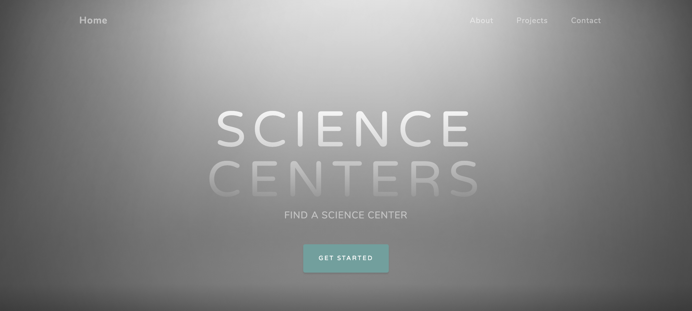
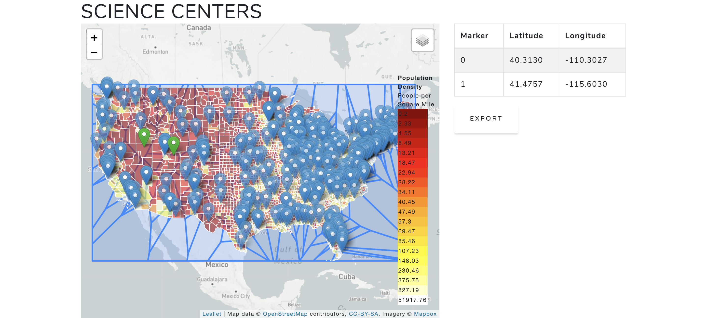
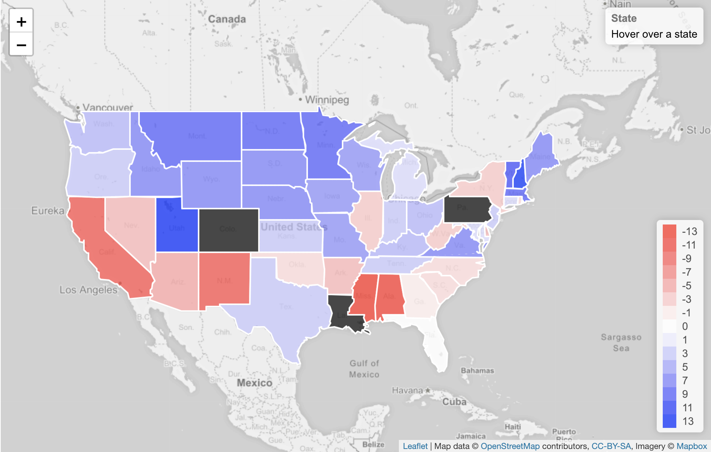

# Science_Center_Project
This is a project which takes information from the US Census, web scraping of astc.org for science center locations, county coordinates, and plots them together finding suitability of where to build.

The core functionality lies within Web_Page folder where you will be able to launch the website, which is also served up here: http://sciencecentersapp-env.nq2tykwyxd.us-east-1.elasticbeanstalk.com/ .   
Data munging and cleanup lies within the Data_Cleanup_And_Output folder. This is where the cleaning and retrieval of the Census data lies, as well as the function that was developed to turn both the census data and science center data into geoJSONs.   

More munging and cleanup for the Student science literacy is available in the Student_Map_Data_Wrangling folder. The function for transforming this data into a geoJSON is the same function used previously.   

The web scraping to retrieve all of the science center data is within the Webscraper folder.   
Finally, the materials used to present this information to a panel exists in the Presentation folder.